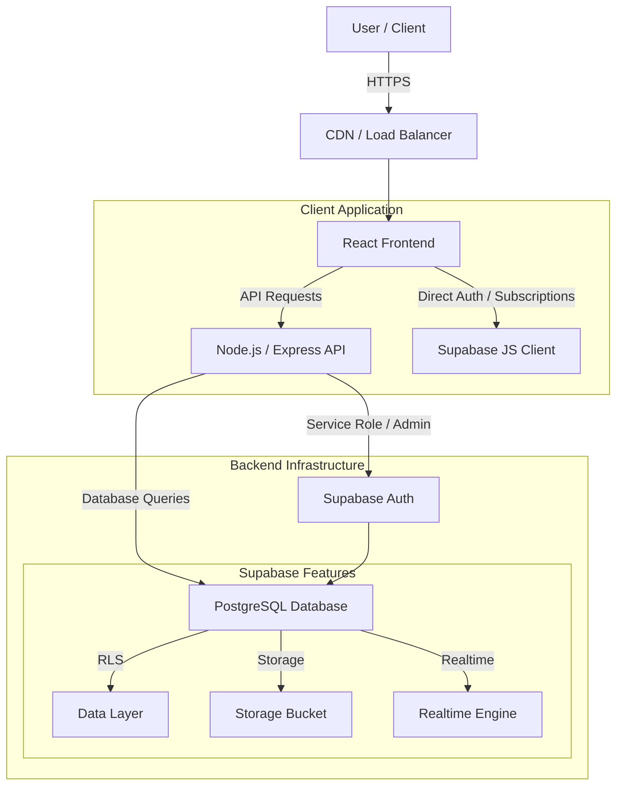
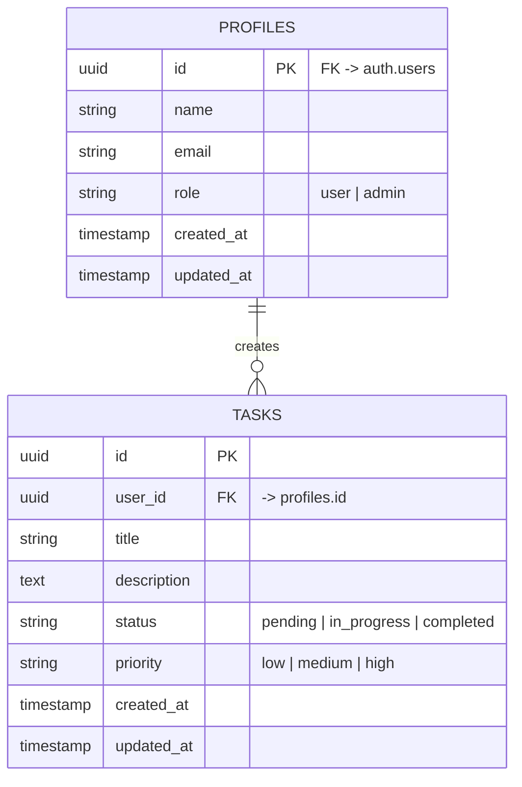

# High-Level Design (HLD) - Backend Intern Assignment

## 1. System Architecture

The system follows a modern client-server architecture leveraging **Supabase** for its backend infrastructure (Database, Auth, Realtime) and a custom **Node.js/Express** API layer for business logic and RBAC. The frontend is built with **React**.

### Architecture Diagram

## 2. Component Interaction Flow

1.  **Authentication**:
    *   User registers/logs in via Frontend -> API -> Supabase Auth.
    *   Supabase returns JWT.
    *   Frontend stores JWT and sends it in `Authorization` header for subsequent requests.

2.  **Task Management (CRUD)**:
    *   **Create**: Frontend -> POST /api/v1/tasks -> API (Validates JWT & Input) -> Supabase DB (Insert).
    *   **Read**: Frontend -> GET /api/v1/tasks -> API (Constructs Query) -> Supabase DB (Select with Pagination).
    *   **Update/Delete**: Frontend -> PUT/DELETE -> API (Checks Ownership/Role via RLS/Middleware) -> Supabase DB.

3.  **Real-time Updates**:
    *   Frontend subscribes to `tasks` table changes via Supabase Client.
    *   Database changes trigger WebSocket events to connected clients.

## 3. Database Schema Design

### ERD Diagram

## 4. API Architecture

*   **Style**: RESTful API
*   **Versioning**: `/api/v1/`
*   **Security**:
    *   JWT Verification (Bearer Token).
    *   Role-Based Middleware (`requireAuth`, `requireAdmin`).
    *   Input Validation (`express-validator`).
    *   Rate Limiting (100 req/15min).

## 5. Scalability Advantages with Supabase

1.  **Managed PostgreSQL**: Supabase provides a fully managed Postgres instance that can scale vertically (CPU/RAM) and horizontally (Read Replicas).
2.  **Connection Pooling**: Uses PgBouncer to manage thousands of concurrent connections efficiently.
3.  **Row-Level Security (RLS)**: Security logic is pushed to the database layer, reducing application code complexity and preventing data leaks even if the API layer is bypassed.
4.  **Real-time Engine**: Built-in scalable WebSocket engine (Elixir-based) handling thousands of concurrent channels.
5.  **Global Edge Network**: Low-latency access via global CDN for static assets and edge functions.
6.  **Auth Scalability**: Handles millions of users with GoTrue (auth server).

## 6. Technology Choices

*   **Node.js/Express**: Non-blocking I/O ideal for handling concurrent API requests.
*   **Supabase (PostgreSQL)**: Combines the reliability of SQL with the ease of a BaaS (Backend-as-a-Service).
*   **React + Vite**: Fast, component-based frontend with optimized build performance.
*   **Tailwind CSS**: Utility-first CSS for rapid UI development and small bundle sizes.
